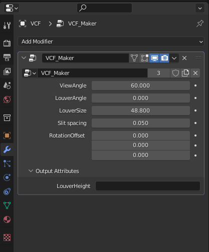
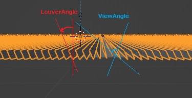
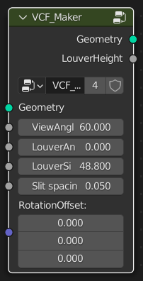
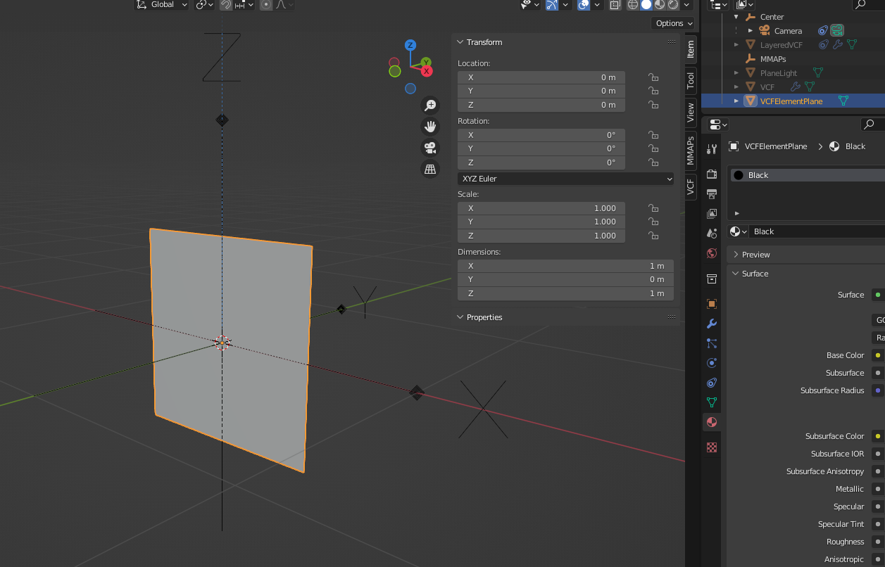
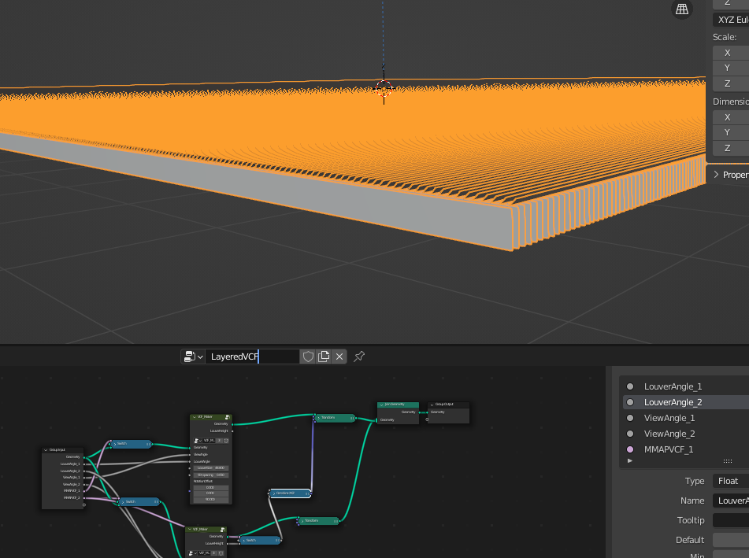
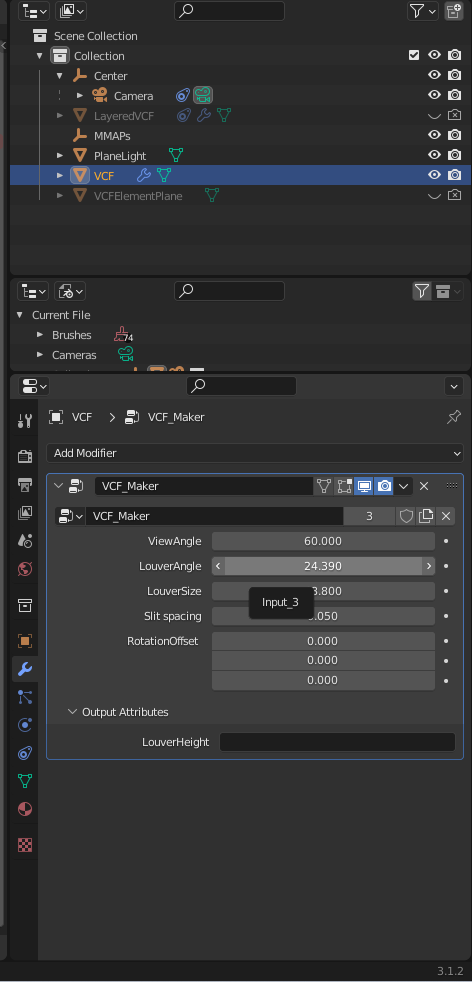

# GeometryNodesVCF


先行のVCF生成モジュール( https://github.com/uec-media-design-lab/MMAPs_Module )をGeometryNodesで実装し、リアルタイムでVCF設定を変更できるBlenderファイルです。

## 使い方



ModifierパネルからGeometryNodesプロパティを編集することでVCFを編集します。

| 名称 | 説明 |
| --- | --- |
|ViewAngle|VCFの視野角|
|LouverAngle|VCFのルーバー角|
|LouverSize|VCFの１辺の長さ|
|Slit Spacing|ルーバーの間隔|
|RotationOffset|VCFの回転|



## 仕様

GeometryNodesの機能を用いて、`VCF_Maker`というノードグループを実装しています。



| Inputs | Outputs |
| --- | --- |
| ViewAngle (float) | LouverHeight (float) |
| LouverAngle (float)| |
| LouverSize (float)| |
| Slit Spacing (float)| |
| RotationOffset (Vector3)| |

このGeometryNodesを、Scaleが1*1のPlaneに適用することでVCFが生成されます。元のGeometryを`VCFElementPlane`として同梱しています。


`LouverHeight`出力では、ルーバーの高さを取得できます。これから値を取得し、VCFを２枚ぴったりと重ねるといった使い方ができます。使用例を`LayeredVCF`オブジェクトとして同梱しています。



## Python Scriptによる制御

Python ScriptからVCFのパラメータを制御する場合は、次のようにしてください。Blender3.1時点では、Geometry Nodesのパラメータ名は内部的に`Input_5`のような規則になっています。

```
bpy.data.objects["VCF"].modifiers["VCF_Maker"]["Input_3"] = 24.39
```
