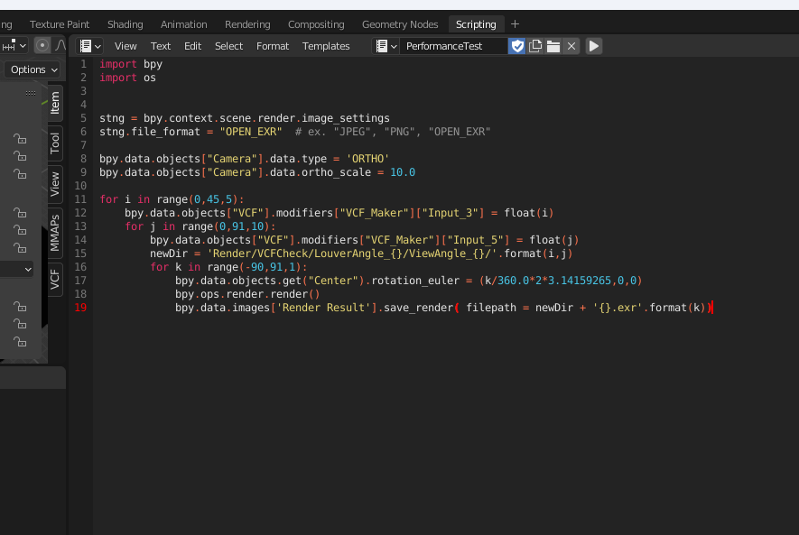
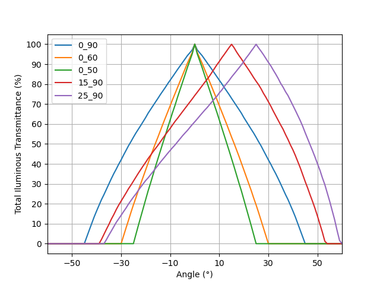

# GeometryNodesVCF


先行のVCF生成モジュール( https://github.com/uec-media-design-lab/MMAPs_Module )をGeometryNodesで実装し、リアルタイムでVCF設定を変更できるBlenderファイルです。

## 使い方


ModifierパネルからGeometryNodesプロパティを編集することでVCFを編集します。

| 名称 | 説明 |
| --- | --- |
|ViewAngle|VCFの視野角|
|LouverAngle|VCFのルーバー角|
|LouverSize|VCFの１辺の長さ|
|Slit Spacing|ルーバーの間隔|
|RotationOffset|VCFの回転|


## 仕様

GeometryNodesの機能を用いて、`VCF_Maker`というノードグループを実装しています。


| Inputs | Outputs |
| --- | --- |
| ViewAngle (float) | LouverHeight (float) |
| LouverAngle (float)| |
| LouverSize (float)| |
| Slit Spacing (float)| |
| RotationOffset (Vector3)| |

このGeometryNodesを、VCFElementPlaneに適用することでVCFが生成されます。元のGeometryを`VCFElementPlane`として同梱しています。


`LouverHeight`出力では、ルーバーの高さを取得できます。これから値を取得し、VCFを２枚ぴったりと重ねるといった使い方ができます。使用例を`LayeredVCF`オブジェクトとして同梱しています。


## VCFElementPlaneの作成方法
    通常のPlaneとVCFElementPlaneは異なるので、以下の手順で作成してください。

    1. Planeを作成
    2. Planeをx軸方向に90°回転
    3. PlaneのScaleを0.5に設定
    4. トランスフォームを適用する(Apply All Transform)


## Python Scriptによる制御

Python ScriptからVCFのパラメータを制御する場合は、次のようにしてください。Blender3.1時点では、Geometry Nodesのパラメータ名は内部的に`Input_5`のような規則になっています。マウスオーバーすることで内部名を参照してください。

```
bpy.data.objects["VCF"].modifiers["VCF_Maker"]["Input_3"] = 24.39
```


## 本VCFの性能値

    VCFを通過する光線の透過率を調べるコードを作成しました。

1. Blender内のScriptタブから`PerformanceTest`スクリプトを実行
    
2. 付属の`MakeVCFPerfomanceGraph.py`を実行
    ```
    python MakeVCFPerformanceGraph.py
    ```

    デフォルトの実行結果は以下です。適宜必要なパラメータを書き換えてグラフを作成してください。
    
